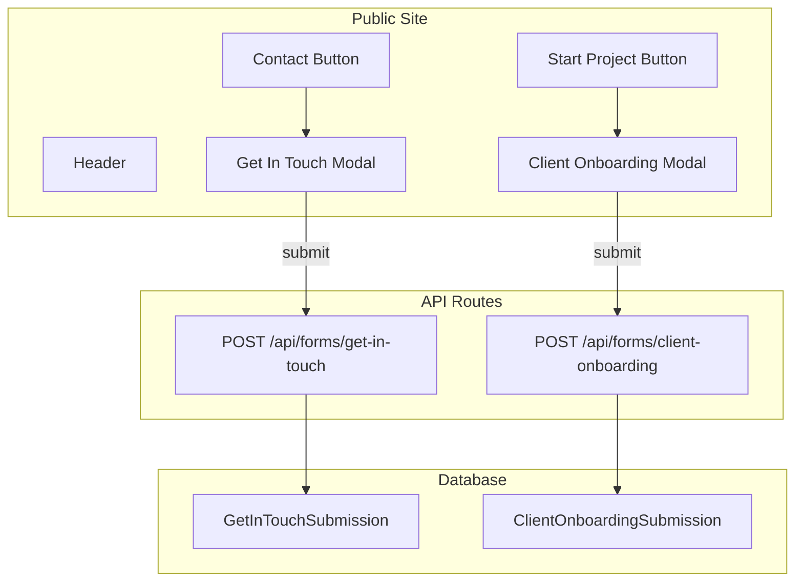

# Contact Forms, Questionnaire, and Admin Listings

## Current State

- **Header** ([components/public/layout/Header.tsx](components/public/layout/Header.tsx)): Has "Start project" button using `OpenContactModalButton` which opens the Get In Touch modal
- **Get In Touch modal** ([components/public/GetInTouchModal.tsx](components/public/GetInTouchModal.tsx)): Single form with Personal Info, Project Info, Project Details; submit handler has `// TODO: wire to API` and closes modal
- **Database**: Prisma with PostgreSQL; no models for form submissions yet
- **Admin** ([components/admin/Sidebar.tsx](components/admin/Sidebar.tsx)): Nav items for Dashboard, Pages, Services, Sections, Media, Settings

---

## 1. Header: Add Contact Button

**File**: [components/public/layout/Header.tsx](components/public/layout/Header.tsx)

- Add a **Contact** button next to "Start project" that opens the Get In Touch modal (same `OpenContactModalButton` component)
- Change "Start project" to open the questionnaire instead (see below)

**Proposed layout**: `[nav links] [Contact] [Start project]` — Contact opens Get In Touch. Start project opens Client Onboarding Questionnaire.

---

## 2. Client Onboarding Questionnaire Modal (Subtask 1)

**New files**:

- `components/public/ClientOnboardingModal.tsx` — Provider + modal content with 6-step form
- Reuse `ModalShell` from [components/public/ui/ModalShell.tsx](components/public/ui/ModalShell.tsx)

**Form structure** (6 steps, scrollable):


| Step | Section                 | Fields                                                                                                                                   |
| ---- | ----------------------- | ---------------------------------------------------------------------------------------------------------------------------------------- |
| 1    | Company Info            | Company Name*, Main Point of Contact*, Preferred Communication Channel (Email/Phone/WhatsApp/Slack/Other), Contact Info                  |
| 2    | About Your Business     | What does your company do?*, Who is your target customer?*, What makes your business unique?                                             |
| 3    | Project Details         | What problem are we solving?*, Desired core features?*, Any existing system or website?, Technical constraints?, Competitors you admire? |
| 4    | Design & Branding       | Logo & brand guide?, Color preferences?, Tone of voice (Playful/Corporate/Minimal/Bold)                                                  |
| 5    | Functional Requirements | Preferred payment gateways?, Specific integrations?, Admin control expectations? Legal: GDPR required?, Terms & Privacy links?           |
| 6    | Timeline & Budget       | Ideal launch date?, Budget range?* Future Vision: Post-MVP features?, Long-term goals?                                                   |


**Implementation approach**:

- Single scrollable modal (as in the screenshots), not a wizard with Next/Back
- Each step rendered as a section with heading and icon
- Step navigation via scroll or optional step indicators
- Submit button at bottom; validate required fields before submit

**Provider integration**:

- Add `ClientOnboardingModalProvider` in [app/(public)/layout.tsx](app/(public)/layout.tsx) alongside `GetInTouchModalProvider`
- Create `OpenClientOnboardingModalButton` (analogous to `OpenContactModalButton`)

---

## 3. Database & API (Subtask 2)

**Prisma schema** ([prisma/schema.prisma](prisma/schema.prisma)):

```prisma
model GetInTouchSubmission {
  id          String   @id @default(cuid())
  fullName    String
  email       String
  phone       String?
  company     String?
  inquiryType String
  budget      String?
  timeline    String?
  subject     String
  message     String   @db.Text
  createdAt   DateTime @default(now())
}

model ClientOnboardingSubmission {
  id        String   @id @default(cuid())
  data      Json     // All form fields as JSON for flexibility
  createdAt DateTime @default(now())
}
```

**API routes** (public POST, no auth):

- `app/api/forms/get-in-touch/route.ts` — POST, validate with Zod, create `GetInTouchSubmission`
- `app/api/forms/client-onboarding/route.ts` — POST, validate with Zod, create `ClientOnboardingSubmission`

**Form wiring**:

- [GetInTouchModal.tsx](components/public/GetInTouchModal.tsx): On submit, POST to `/api/forms/get-in-touch`, show success/error, close on success
- `ClientOnboardingModal.tsx`: On submit, POST to `/api/forms/client-onboarding`, same pattern

---

## 4. Admin List Pages (Subtask 3)

**Sidebar** ([components/admin/Sidebar.tsx](components/admin/Sidebar.tsx)):

Add nav items:

- `{ href: "/admin/get-in-touch", label: "Get In Touch", icon: "✉️" }`
- `{ href: "/admin/client-onboarding", label: "Client Onboarding", icon: "📋" }`

**New pages**:

- `app/(admin)/admin/get-in-touch/page.tsx` — Server component, fetch `GetInTouchSubmission` list, table with columns: Name, Email, Company, Inquiry Type, Subject, Date, optional expand for full details
- `app/(admin)/admin/client-onboarding/page.tsx` — Server component, fetch `ClientOnboardingSubmission` list, table with: Company Name (from `data.companyName`), Contact (from `data.mainPointOfContact`), Date, link to detail view

**Detail view** (optional): `/admin/client-onboarding/[id]` to show full JSON payload in a readable layout.

---

## Data Flow




---

## File Summary


| Action | Path                                                                                     |
| ------ | ---------------------------------------------------------------------------------------- |
| Edit   | `components/public/layout/Header.tsx` — Add Contact, wire Start project to questionnaire |
| Create | `components/public/ClientOnboardingModal.tsx` — Provider + 6-step form                   |
| Create | `components/public/OpenClientOnboardingModalButton.tsx`                                  |
| Edit   | `app/(public)/layout.tsx` — Add ClientOnboardingModalProvider                            |
| Edit   | `prisma/schema.prisma` — Add models                                                      |
| Create | `app/api/forms/get-in-touch/route.ts`                                                    |
| Create | `app/api/forms/client-onboarding/route.ts`                                               |
| Edit   | `components/public/GetInTouchModal.tsx` — Wire submit to API                             |
| Edit   | `components/admin/Sidebar.tsx` — Add nav items                                           |
| Create | `app/(admin)/admin/get-in-touch/page.tsx`                                                |
| Create | `app/(admin)/admin/client-onboarding/page.tsx`                                           |


---

## Post-Implementation

- Run `prisma db push` or `prisma migrate dev` to apply schema changes
- Email integration can be added later by updating the API route handlers

