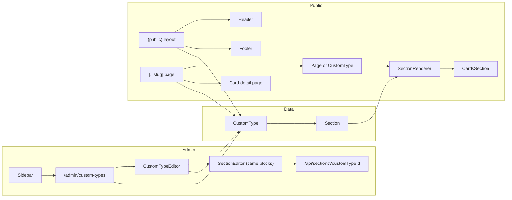

# Custom Types and Dynamic Menus Plan

## Current state (brief)

- **Admin:** Static sidebar in [components/admin/Sidebar.tsx](components/admin/Sidebar.tsx) with fixed "Services" link; services CRUD at `/admin/services`, edited via [components/admin/ServiceEditor.tsx](components/admin/ServiceEditor.tsx) (simple form: slug, title, description, image, etc.).
- **Pages:** [prisma/schema.prisma](prisma/schema.prisma) has `Page` (with banner fields) and `Section` (pageId, type, order, content). [components/admin/PageEditor.tsx](components/admin/PageEditor.tsx) uses the same section types (textImage, imageSlider, headingParagraph, cards, projectLifeCycle) and [components/admin/SectionEditor.tsx](components/admin/SectionEditor.tsx) for block editing. Sections API: [app/api/sections/route.ts](app/api/sections/route.ts) (GET by `pageId`, POST requires `pageId`).
- **Public nav:** [app/(public)/layout.tsx](app/(public)/layout.tsx) builds `navPages` from published pages and `showServicesLink` from published service count; [Header](components/public/layout/Header.tsx) and [Footer](components/public/layout/Footer.tsx) render pages + optional "Services" link.
- **Routes:** [app/(public)/[...slug]/page.tsx](app/(public)/[...slug]/page.tsx) resolves single-segment (or multi) slug to a **Page**; `"services"` is reserved. `/services` and `/services/[slug]` are separate route files for the current services feature.
- **Cards:** [types/cms.ts](types/cms.ts) `CardItem` has heading, description, overview, services, image, URLs. [CardsSection](components/public/sections/CardsSection.tsx) always opens [CardDetailModal](components/public/sections/CardDetailModal.tsx) on "View Details"; no per-card "open in new page" or slug.

---

## 1. Data model

**New model: CustomType** (in `prisma/schema.prisma`)

- Fields: `id`, `slug` (unique), `name` (display label, e.g. "Who we are"), `showInHeader` (boolean), `showInFooter` (boolean), `isPublished`, `order`, same banner fields as `Page` (bannerTitle, bannerText, bannerBackgroundImage, etc. — optional, for consistency with page editor), `createdAt`, `updatedAt`.
- Slug: auto-generated from name (e.g. "Who we are" → `who-we-are`). Add a small `slugify(name)` helper (lowercase, replace spaces with `-`, strip non-alphanumeric-dash). Expose slug as editable in admin (like pages) so it can be overridden.

**Sections for custom types**

- Reuse `Section` with an optional second parent: add `customTypeId String?` to `Section`, make `pageId String?` optional. Ensure exactly one of `pageId` or `customTypeId` is set (enforce in API). Add relation `CustomType sections Section[]` and update `Section` relation to `page Page?` and `customType CustomType?`.
- Sections API: support `?customTypeId=...` for GET; POST body may send either `pageId` or `customTypeId` (validated: one required, not both).

**Card link behavior**

- Extend `CardItem` in [types/cms.ts](types/cms.ts): add `openInModal?: boolean` (default true for backward compatibility) and `cardSlug?: string` (used when openInModal is false for URL segment). No new DB tables; this lives in section `content.cards[]` JSON.

---

## 2. API layer

- **Custom types CRUD**
  - `GET/POST /api/custom-types` — list (for nav, admin list) and create (auth for POST).
  - `GET/PUT/DELETE /api/custom-types/[id]` — get one, update, delete (auth for mutate). GET by slug for public: e.g. `GET /api/custom-types?slug=who-we-are` or resolve in server components via Prisma.
- **Sections**
  - [app/api/sections/route.ts](app/api/sections/route.ts): allow `pageId` or `customTypeId` in query (GET) and in body (POST). Validation: exactly one of the two.
  - [app/api/sections/[id]/route.ts](app/api/sections/[id]/route.ts): no change to URL shape; section already has id; ensure updates don’t flip parent (pageId/customTypeId) unless you explicitly support moving (optional; can leave as-is).
- **Slug uniqueness**
  - Custom type slug must be unique and not collide with reserved paths. Reserved list: `services`, `admin`, `admin-login`, `api`, etc. Validate on create/update (and optionally reject slugs that match existing page slugs if you want a single namespace).

---

## 3. Admin panel

- **Sidebar**
  - Remove the single "Services" link. Add a "Custom types" parent or area: either one link "Custom types" that goes to a list page, or dynamically list each custom type as a sub-item. Recommended: one "Custom types" link to `/admin/custom-types` (list), and each custom type row has "Edit" to `/admin/custom-types/[id]`. Sidebar can show a single "Custom types" nav item (like "Pages"); no need to dynamically load custom types in the sidebar unless you want a nested menu.
- **Custom types list** (`/admin/custom-types`)
  - Table: name, slug, order, showInHeader, showInFooter, isPublished, Edit/Delete. "New custom type" button → `/admin/custom-types/new`.
- **Custom type editor** (new + edit)
  - Reuse the same structure as PageEditor: form for slug (pre-filled from name, editable), name, showInHeader, showInFooter, isPublished, order, and banner fields (reuse same banner UI as PageEditor). Below that, "Sections" block: same "Add section" buttons (textImage, imageSlider, headingParagraph, cards, projectLifeCycle) and list of `SectionEditor` instances. Load sections with `GET /api/sections?customTypeId=...`; create section with `POST /api/sections` with `customTypeId` (and no pageId). Use a new component (e.g. `CustomTypeEditor`) that mirrors `PageEditor` but for CustomType and customTypeId. No "Set as home" for custom types.
- **SectionEditor (cards)**
  - In the cards section of [components/admin/SectionEditor.tsx](components/admin/SectionEditor.tsx), for each card add:
    - Radio or select: "Open in: Modal | New page". Default "Modal".
    - When "New page" is selected, show a slug field (e.g. "Card URL slug") — pre-fill from heading (slugify) and allow edit. Store `openInModal: false` and `cardSlug: "<slug>"` on the card.
  - Persist in existing section content; no API change.

---

## 4. Public layout and nav

- **Layout data**
  - In [app/(public)/layout.tsx](app/(public)/layout.tsx), besides published pages and `publishedServicesCount`, fetch published custom types (ordered) with `showInHeader` or `showInFooter`. Build two lists: `headerCustomTypes` (showInHeader) and `footerCustomTypes` (showInFooter). Pass to Header and Footer.
- **Header**
  - [components/public/layout/Header.tsx](components/public/layout/Header.tsx): accept e.g. `customTypesInHeader: { slug, name }[]`. Render nav as: existing `navPages` (pages), then each custom type link to `/${slug}`. Remove the hardcoded "Services" link; if you want "Services" to appear, it will be as a custom type named "Services" with slug `services` and showInHeader true.
- **Footer**
  - [components/public/layout/Footer.tsx](components/public/layout/Footer.tsx): accept e.g. `customTypesInFooter: { slug, name }[]` and render them in "Our menu" (or equivalent) after/before page links, same pattern: link to `/${slug}`.

---

## 5. Public routing and rendering

- **Reserved slugs**
  - In [app/(public)/[...slug]/page.tsx](app/(public)/[...slug]/page.tsx), keep reserved list (e.g. `services`, `admin`, `admin-login`, `api`). Optionally add any slug that matches a top-level route segment used by Next.js (e.g. `services` for the existing `/services` page). So if a custom type has slug `services`, you must either keep the current `/services` and `/services/[slug]` behavior and exclude `services` from custom type slug, or migrate services into a custom type and remove the old services routes. Plan assumes: reserve `services` in catch-all so that the existing `/services` and `/services/[slug]` routes still work; custom type slugs cannot be `services`. (Alternatively, you can later make "Services" a custom type and remove the old service routes; that can be a follow-up.)
- **Single-segment: page vs custom type**
  - For `slug = [single]` (e.g. `who-we-are`): first try `Page` by slug; if not found, try `CustomType` by slug (and isPublished). If custom type found, render same structure as dynamic page: `PageBanner` (from custom type banner fields) + sections via `SectionRenderer`. Use the same `SectionRenderer` and section types; only the data source (custom type’s sections) changes.
- **Two-segment: custom type + card**
  - For `slug = [first, second]` (e.g. `who-we-are`, `ai-application`): try Page by full slug string first (current behavior). If no page, try CustomType by `first`; if found, load its sections, find in any `cards` section a card where `cardSlug === second` (or matching). If found, render a "card detail" page: e.g. same content as CardDetailModal but as a full page (title, image, overview, services, links). If not found, `notFound()`.
- **SectionRenderer and CardsSection**
  - SectionRenderer needs an optional `basePath?: string` (the custom type slug when we’re on a custom type page). When rendering a `cards` section, pass `basePath` to CardsSection. CardsSection: if `basePath` is set and a card has `openInModal === false` and `cardSlug`, render "View Details" as a `Link` to `/${basePath}/${cardSlug}`; otherwise keep current behavior (button that opens modal). This keeps pages without basePath unchanged (all cards modal).

---

## 6. Card detail as page

- **Component**
  - Add a small client or server component that renders one card’s content (heading, image, overview, services, live demo/source links) — same as CardDetailModal content but without modal shell. Use it on the `/[customTypeSlug]/[cardSlug]` response when we resolve a card.
- **Metadata**
  - generateMetadata for the two-segment case: use custom type name + card heading as title.

---

## 7. Dashboard and cleanup

- **Dashboard**
  - [app/(admin)/admin/page.tsx](app/(admin)/admin/page.tsx): replace "Total Services" with "Custom types" (count of CustomType). Link to `/admin/custom-types`. Optionally keep a separate "Services" count only if you retain the old Service model for something else; otherwise remove.
- **Services**
  - Decision: either (A) remove Service model and all service routes/UI and migrate to a single custom type "Services" (slug `services`), or (B) keep Service for now and only add Custom types alongside. Plan assumes (B) for minimal change: add Custom types, remove "Services" from sidebar and nav, and keep `/services` and `/services/[slug]` and Service model in DB until you explicitly migrate. If you prefer (A), the plan would include removing Service and converting existing services into one custom type’s content or a separate data source.
  - Clarification: you said "Instead of services let’s change it to custom type". So the sidebar entry "Services" becomes the entry point for "Custom types". The old Services CRUD can be removed or hidden: remove `/admin/services` routes and Service model usage from nav; optionally keep the Service model and `/services` routes for backward compatibility with existing content, or migrate. Plan will assume: sidebar shows "Custom types" only; admin routes for old "services" are removed; public `/services` and `/services/[slug]` can remain for backward compatibility or be removed in a later step. Specify in implementation whether to delete Service or keep it read-only.

---

## 8. Sitemap

- [app/sitemap.ts](app/sitemap.ts): add published custom types: one URL per custom type `/${slug}`. For each published custom type that has card sections, optionally add URLs for each card with `openInModal === false` and a cardSlug: `/${customTypeSlug}/${cardSlug}`.

---

## 9. File and flow summary

| Area                               | Action                                                                                                                                                                                                                                                                     |
| ---------------------------------- | -------------------------------------------------------------------------------------------------------------------------------------------------------------------------------------------------------------------------------------------------------------------------- |
| **Schema**                         | Add `CustomType` model; add `customTypeId` to `Section`, make `pageId` optional; relation CustomType → sections.                                                                                                                                                           |
| **Types**                          | Add `CustomTypeData`; extend `CardItem` with `openInModal?`, `cardSlug?`.                                                                                                                                                                                                  |
| **API**                            | Add `/api/custom-types` and `/api/custom-types/[id]`; extend sections API to support `customTypeId`.                                                                                                                                                                       |
| **Admin**                          | Sidebar: replace Services with "Custom types"; add `/admin/custom-types`, `/admin/custom-types/new`, `/admin/custom-types/[id]`; implement CustomTypeEditor (like PageEditor, sections by customTypeId); SectionEditor cards: add open-in-modal vs new-page and card slug. |
| **Public layout**                  | Fetch custom types (showInHeader/showInFooter), pass to Header and Footer; Header/Footer render custom type links.                                                                                                                                                         |
| **Catch-all**                      | Resolve single-segment to Page then CustomType; two-segment to Page then CustomType+card; reserve `services` (and others).                                                                                                                                                 |
| **SectionRenderer / CardsSection** | Optional `basePath` prop; CardsSection uses it to render link for cards with openInNewPage + cardSlug.                                                                                                                                                                     |
| **Card detail page**               | New component for full-page card content; used in two-segment route.                                                                                                                                                                                                       |
| **Dashboard**                      | Show Custom types count; link to custom types.                                                                                                                                                                                                                             |
| **Sitemap**                        | Include custom type URLs and card sub-URLs.                                                                                                                                                                                                                                |

---

## 10. Architecture diagram

---

## 11. Slug and reserved routes

- **Slugify:** `name` → slug: trim, toLowerCase, replace(/\s+/g, "-"), replace(/[^a-z0-9-]/g, ""). Use when creating custom type; allow manual override in form.
- **Reserved (catch-all):** at least `services`, `admin`, `admin-login`, `api`. Consider also reserving any path that has a dedicated app route (e.g. `services`). Custom type slugs validated to not be in this list.

---

## 12. Migration and backward compatibility

- **DB:** One migration: add CustomType model; add `customTypeId` to Section and make `pageId` optional. Existing sections keep `pageId` set; new custom type sections set `customTypeId` only.
- **Existing pages:** No change; they use pageId and existing [...slug] resolution.
- **Cards on pages:** No `basePath` passed, so all cards keep modal behavior. Cards on custom type pages get basePath and can use modal or new page per card.

This keeps the current page/section/card architecture, reuses Section and SectionEditor, and adds custom types as a parallel concept with dynamic admin and nav entries and optional card sub-routes.